# Exercício utilizando Xamarin & Microsoft Cognitive Services

O objetivo desse laboratório é criar um aplicativo utilizando o framework __Xamarin__ e a ferramenta __Face API Service__ do __Cognitive Services__ para analisar e reconhecer rostos.


# Estrutura do repositório

Pastas:

* CognitiveServicesLabIncompleto: Pasta contendo o projeto para ser utilizado durante o laboratório;
* CognitiveServicesCompleto: Pasta contendo o projeto completo. Serve como base para quem possui dúvidas. O projeto pode não funcionar por conta da expiração do serviço de backend no Azure.
* Imagens: Imagens utilizadas no arquivo README.md;
* ImagensParaTestes: Imange utilizadas para testar o aplicativo. Foram retiradas [desse repositório](https://github.com/Microsoft/Cognitive-Face-Windows/tree/master/Data) .

# Todo

* Arrumar problemas de compilação para a o Android no Visual Studio Windows.

# Requisitos

* Conta no Microsoft Azure;
* Visual Studio 2017 com os pacotes do Xamarin instalados ou Visual Studio for Mac;
* Emulador ou dispositivo Android;

# Criando um serviço do tipo __Face API Service__

1. No portal do Azure, clique em __New__:

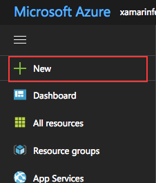

2. Digite __Face API__ no campo de busca e crie um novo serviço:

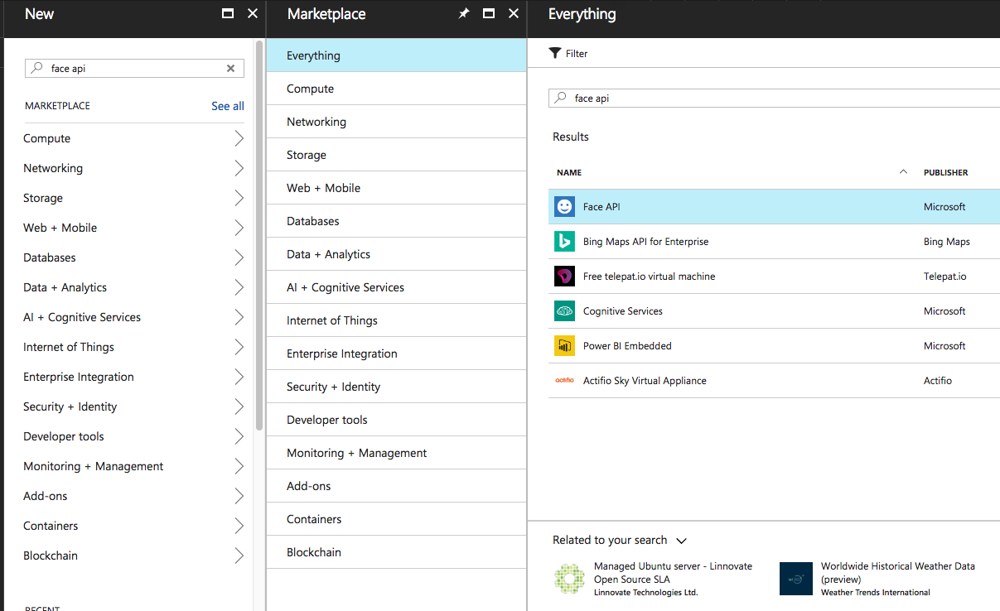

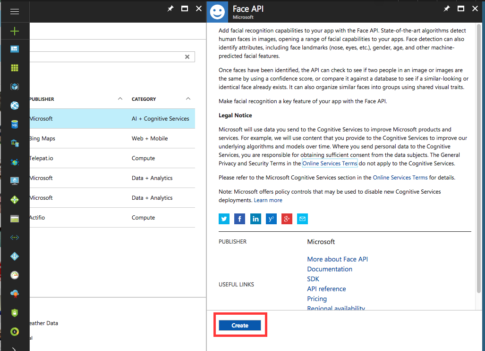

3. Preencha os dados e clique em __Create__:

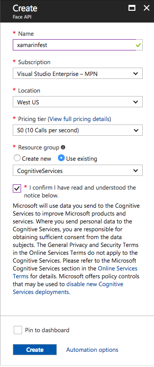

4. Aguarde o __Azure__ criar o serviço:

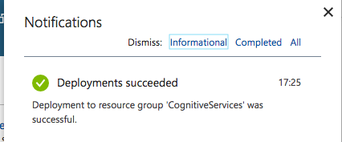

5. Vá em __All resources__ e escolha no serviço criado e, em seguida, em __Show access keys__:

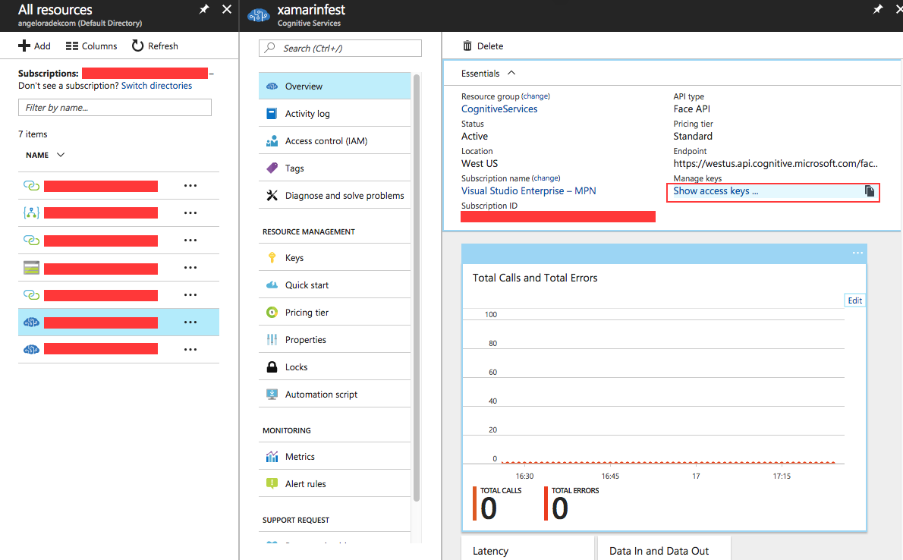

6. Copie o valor de __KEY 1__ e guarde-0

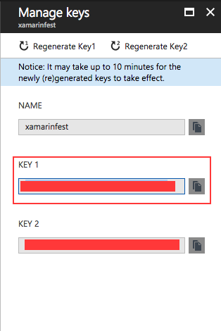

# Aplicativo de testes com o Xamarin

O código da biblioteca que será utilizada para acessar o __Cognitive Face__ pode ser encontrado [nesse repositório](https://github.com/Microsoft/Cognitive-Face-Windows/tree/master/ClientLibrary) .

1. Copie o trecho e código abaixo e cole no arquivo __CognitiveSercies.Service/Person.cs__:

```CSharp
using System;
namespace CognitiveServices
{
	public class Person
	{
		public Person()
		{
		}

		public string PersonId { get; set; }

		public string GroupId { get; set; }

		public string Name { get; set; }

		public string PhotoUrl { get; set; }

		public string City { get; set; }
	}
}
```

2. Copie o trecho e código abaixo e cole no arquivo __CognitiveSercies.Service/Services.cs__:

```CSharp
using System;
using System.Collections.Generic;
using System.IO;
using System.Linq;
using System.Threading.Tasks;
using Microsoft.ProjectOxford.Face;
using Microsoft.ProjectOxford.Face.Contract;

namespace CognitiveServices
{
	public class Service
	{
		public static Service Instance { get; } = new Service();

		public Service()
		{
			FaceServiceClient = new FaceServiceClient("SeuToken");
            _personGroupId = Guid.NewGuid().ToString();
		}

		public List<Person> People { get; } = new List<Person>
		{
			new Person{
				Name = "Fulano",
				PhotoUrl = "URL de uma foto de acesso publica no facebook",
                City = "Cidade de nascimento"
			},
			new Person{
				Name = "Ciclano",
				PhotoUrl = "URL de uma foto de acesso publica no facebook",
				City = "Cidade de nasciemento"
			}
		};

		string _personGroupId;

		public FaceServiceClient FaceServiceClient { get; private set; }

		public async Task RegisterEmployees()
		{
			await FaceServiceClient.CreatePersonGroupAsync(_personGroupId, "NomeDoGrupoDePessoas");

			foreach (var xmvp in People)
			{
				var p = await FaceServiceClient.CreatePersonAsync(_personGroupId, xmvp.Name);
				await FaceServiceClient.AddPersonFaceAsync(_personGroupId, p.PersonId, xmvp.PhotoUrl);
				xmvp.GroupId = _personGroupId;
				xmvp.PersonId = p.PersonId.ToString();
			}

			await TrainPersonGroup();
		}

		public async Task<List<Person>> FindSimilarFace(Stream faceData)
		{
			var faces = await FaceServiceClient.DetectAsync(faceData);
			var faceIds = faces.Select(face => face.FaceId).ToArray();

			var results = await FaceServiceClient.IdentifyAsync(_personGroupId, faceIds);
            var persons = new List<Person>();
            foreach (var faceid in results)
            {
                if (faceid.Candidates.Count() != 0)
                {
                    var person = await FaceServiceClient.GetPersonAsync(_personGroupId, faceid.Candidates[0].PersonId);
                    persons.Add(new Person { Name = person.Name, PersonId = person.PersonId.ToString() });
                }
            }
            return persons;
		}

		public async Task<bool> AddFace(Stream faceData, Person person)
		{
			try
			{
				var result = await FaceServiceClient.AddPersonFaceAsync(person.GroupId, Guid.Parse(person.PersonId), faceData);
				if (result == null || string.IsNullOrWhiteSpace(result.PersistedFaceId.ToString()))
					return false;
				return true;
			}
			catch
			{
				return false;
			}
		}

		public async Task TrainPersonGroup()
		{
			try
			{
				await FaceServiceClient.TrainPersonGroupAsync(_personGroupId);
				TrainingStatus trainingStatus = null;
				while (true)
				{
					trainingStatus = await FaceServiceClient.GetPersonGroupTrainingStatusAsync(_personGroupId);

					if (trainingStatus.Status != Status.Running)
					{
						break;
					}

					await Task.Delay(1000);
				}
				return;
			}
			catch
			{
				return;
			}
		}

		public async Task<Face> AnalyzeFace(Stream faceData)
		{
			var faces = await FaceServiceClient.DetectAsync(faceData, false, false, new List<FaceAttributeType> {
				FaceAttributeType.Age,
				FaceAttributeType.FacialHair,
				FaceAttributeType.Gender,
				FaceAttributeType.Glasses,
				FaceAttributeType.HeadPose,
				FaceAttributeType.Smile
			});
			if (faces.Length > 0)
				return faces[0];
			return null;
		}
	}
}
```

3. Ainda no mesmo arquivo, subtitua o texto __SeuToken__ pelo token copiado do Azure:

```CSharp
FaceServiceClient = new FaceServiceClient("SeuToken");
```

4. Crie um nome para o seu grupo de pessoas:

```CSharp
await FaceServiceClient.CreatePersonGroupAsync(_personGroupId, "NomeDoGrupoDePessoas");
```

5. Adicone pessoas a sua lista. As fotos podem ser pegas do Facebook clicando com o botão direito e copiando a URL da imagem, desde que, a imagem seja pública.

Obs.: Para testar o aplicativo, precisa-se de uma foto contendo todas as pessoas da lista. Para facilitar, pode-se pegar URL de fotos do Facebook das pessoas presentes no evento e tirar uma foto juntos para testar.

Obs. 2: Para facilitar, utilizei [essas imagens](https://github.com/angelopolotto/XamarinLabCognitiveServices/tree/master/ImagensParaTestes), retiradas do [repositório da Microsoft](https://github.com/Microsoft/Cognitive-Face-Windows/tree/master/Data), para facilitar os testes.

```CSharp
public List<Person> People { get; } = new List<Person>
{
	new Person{
		Name = "Maria",
		PhotoUrl = "https://github.com/angelopolotto/XamarinLabCognitiveServices/blob/master/ImagensParaTestes/2%20-%20Maria.jpg?raw=true",
		City = "Colombo"
	},
	new Person{
		Name = "José",
		PhotoUrl = "https://github.com/angelopolotto/XamarinLabCognitiveServices/blob/master/ImagensParaTestes/3%20-%20Jose.jpg?raw=true",
		City = "Curtiba"
	}
};
```

6. Selecione uma plataforma que deseja executar (Android ou iOS) o projeto e clique em __Run__. As imagens a seguir mostram o aplicativo em um simulador de iPhone:

* Reconhecimento das pessoas na foto:

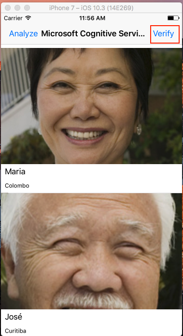

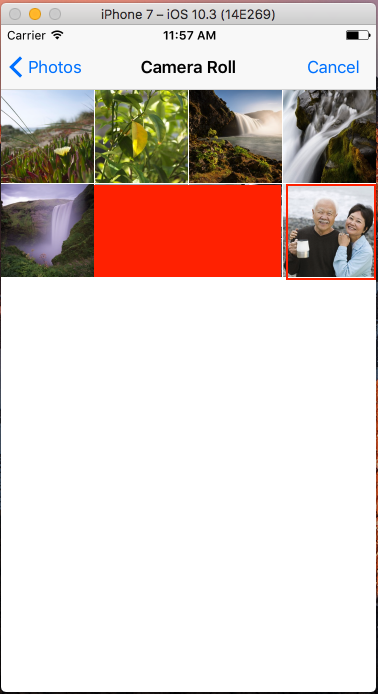

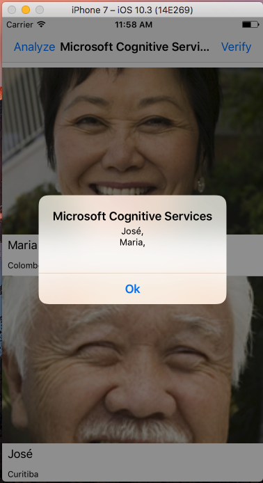

* Analise do rosto de uma pessoa em uma foto qualquer:

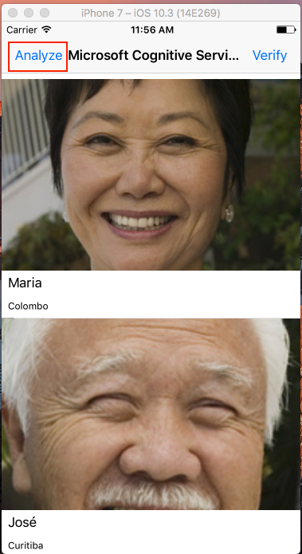


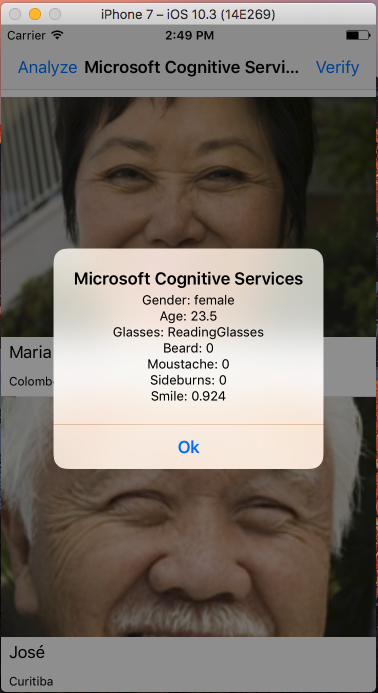

7. Pontos importantes do código criado:

```CSharp
//0. A linha a seguir verifica o status do treinamento e aguarda um tempo para a sua conclusão
TrainingStatus trainingStatus = null;
while (true)
{
      trainingStatus = await FaceServiceClient.GetPersonGroupTrainingStatusAsync(_personGroupId);
			if (trainingStatus.Status != Status.Running)
			{
					break;
			}
			await Task.Delay(1000);
}

//1. Reconhecimento faces na imagem (Stream faceData)
var faces = await FaceServiceClient.DetectAsync(faceData);

//2. Conversão do resultado em um array
var faceIds = faces.Select(face => face.FaceId).ToArray();

//3. Procura pelos Ids encontrados dentro do grupo cadastrado anteriormente
var results = await FaceServiceClient.IdentifyAsync(_personGroupId, faceIds);

//4. Recupera o Id primeira pessoa reconhecida dentro do grupo
var result = results[0].Candidates[0].PersonId;

//5. Mostra os dados da pessoa identificada
var person = await FaceServiceClient.GetPersonAsync(_personGroupId, result);
```
